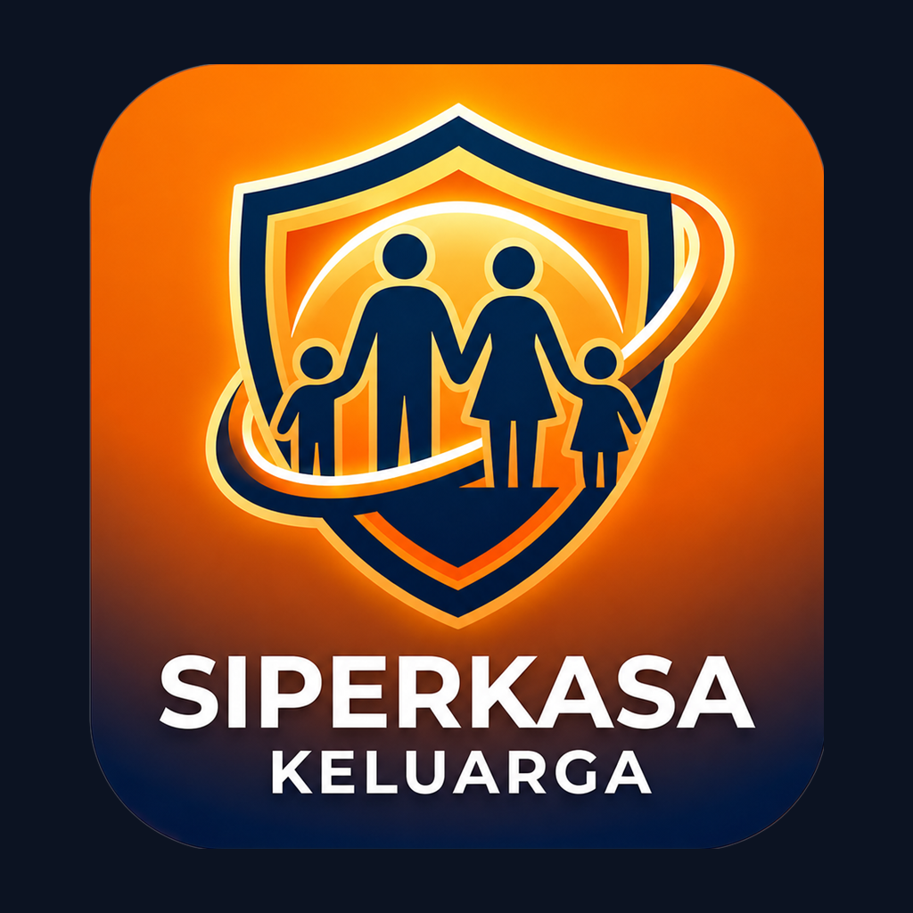

<div align="center">



# 🛡️ SIGAP — Family

**Pendamping keluarga untuk ekosistem keselamatan berkendara SIGAP.**

Memantau perjalanan anggota keluarga secara real-time dan menerima peringatan darurat saat terjadi kecelakaan.


</div>

---

## ✨ Fitur

- 👨‍👩‍👧 **Pantau anggota keluarga** — lihat status & lokasi pengemudi secara real-time.
- 🚨 **Peringatan darurat instan** — notifikasi langsung saat deteksi kecelakaan terpicu.
- 🗺️ **Riwayat perjalanan** — pantau rute dan aktivitas berkendara keluarga.
- 🔗 **Terhubung dengan SIGAP-Siswa** — data mengalir dari aplikasi pengemudi.
- 🎨 **Design system "Dark Guardian"** — konsisten dengan seluruh ekosistem SIGAP.

## 🛠️ Tech Stack

**Framework:** Expo (Expo Router) · React Native · TypeScript
**Lokasi & notifikasi:** expo-location · expo-notifications
**Backend:** Firebase · Google Generative AI (Gemini)
**UI:** expo-linear-gradient · lucide-react-native · react-native-reanimated

## 🚀 Menjalankan

```bash
# Pasang dependency
npm install

# Jalankan (buka di Expo Go / emulator)
npm start
```

> Butuh [Node.js LTS](https://nodejs.org). Salin `.env.example` → `.env` dan `eas.json.example` → `eas.json`, lalu isi kredensial Firebase & API key (file asli sengaja diabaikan dari repo demi keamanan).

## 🧩 Ekosistem SIGAP

| Aplikasi | Peran |
|---|---|
| [SIGAP-Siswa](https://github.com/PiwPiyolett/SIGAP-Siswa) | Aplikasi pengemudi — deteksi kecelakaan & SOS |
| **SIGAP-Family** (repo ini) | Pendamping keluarga — memantau pengemudi |
| [SIGAP-Sekolah](https://github.com/PiwPiyolett/SIGAP-Sekolah) | Pemantauan pihak sekolah |

---

<div align="center">

**Ariqo Banyusila Abrar** · [@PiwPiyolett](https://github.com/PiwPiyolett)

</div>
